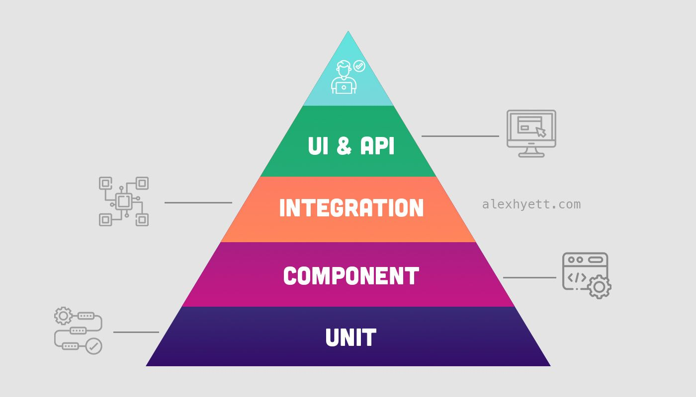

[//]: # (TODO - add integration test &#40;load spting boot context, use test container&#41;)

# Purpose

# How to run

TODO

# Testing

These project contains unit, component and integration tests.

## Unit tests

These tests do not start the Spring context. Unit test is, for
example, [ListServiceImplTest](./src/test/kotlin/cz/vavrecka/todolist/service/impl/ListServiceImplTest.kt).

## Component tests

Component tests
use [Spring boot slice](https://docs.spring.io/spring-boot/reference/testing/spring-boot-applications.html).The purpose
of component tests is to test application parts that require the
Spring context, such as error handling in a controller

## Integration tests

These tests start entire Spring application. These test
use technology like [Test container](./src/test/kotlin/cz/vavrecka/integration/TestcontainersConfiguration.kt)

## Test Suite

**There is two test suits:**

- [Pull request suit](./src/test/kotlin/cz/vavrecka/suite/PullRequestTestSuit.kt) runs unit and component test cases
- [Relese suit](./src/test/kotlin/cz/vavrecka/suite/ReleaseTestSuit.kt) runs unit, component and integration test cases

**To run suite test via maven use this command:**

- [Pull request suit](./src/test/kotlin/cz/vavrecka/suite/PullRequestTestSuit.kt) -> mvn test -Dtest=**
  /PullRequestTestSuit.class
- [Relese suit](./src/test/kotlin/cz/vavrecka/suite/ReleaseTestSuit.kt) -> mvn test -Dtest=**/ReleaseTestSuit.class

